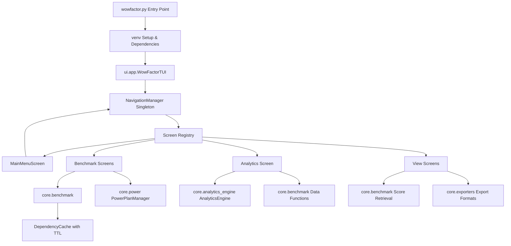
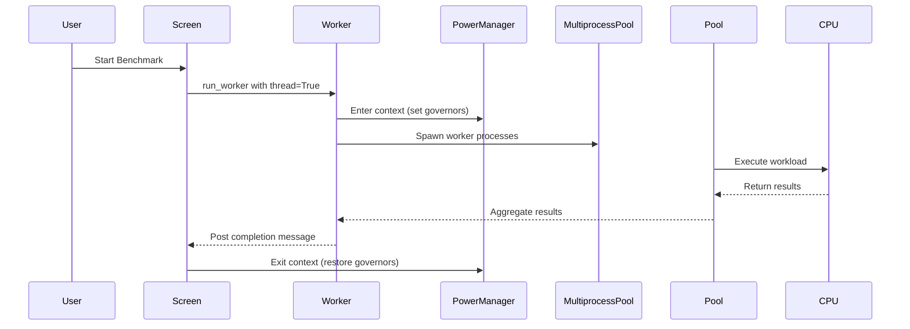

# WowFactor Architecture Review Report

**Review Date:** 2026-04-15  
**Version Reviewed:** 1.1.0  
**Reviewer:** Architect Mode Analysis  

---

## Executive Summary

The WowFactor application is a Python-based benchmarking and analytics tool with a Textual TUI. The codebase demonstrates good modularization with clear separation between core logic (`core/`) and UI components (`ui/`). However, several architectural issues have been identified that impact maintainability, testability, and production readiness.

---

## 1. Current Architecture Overview

### 1.1 Component Structure

```
WowFactor (v1.1.0)
├── wowfactor.py          # Entry point with venv management
├── core/                 # Business logic layer
│   ├── analytics_engine.py    # Statistical analysis
│   ├── benchmark.py           # Benchmark execution engine
│   ├── comparator.py          # Results comparison
│   ├── config.py              # Configuration management
│   ├── exporters.py           # Data export formats
│   ├── power.py               # Power plan management
│   └── system_deps.py         # System dependency checks
├── ui/                   # Textual TUI layer
│   ├── app.py                 # Main application class
│   ├── components.py          # UI widgets and screens (DUPLICATE)
│   ├── navigation.py          # NavigationManager singleton
│   ├── shared.py              # Shared UI components
│   ├── theme.py               # Design tokens
│   ├── messages.py            # Custom message classes
│   ├── notifications.py       # Toast notification system
│   ├── layout_utils.py        # Layout optimization utilities
│   └── screens/               # Screen implementations
│       ├── base_screen.py     # Base screen with services mixin
│       ├── benchmark.py       # Benchmark screens (DUPLICATE)
│       ├── analytics.py       # Analytics dashboard
│       ├── main_menu.py       # Main menu screen
│       ├── views.py           # Data viewing screens
│       └── profile_selection  # Profile management
├── tests/                # Test suite
└── docs/                 # Documentation
```

### 1.2 Architecture Diagram



### 1.3 Data Flow

1. **Benchmark Execution Flow:**
   - User initiates benchmark → [`RunSingleBenchmarkScreen`](ui/screens/benchmark.py:65)
   - Screen validates input → Calls [`execute_single_benchmark_run()`](core/benchmark.py:272)
   - Benchmark uses [`PowerPlanManager`](core/power.py:10) context manager
   - Results saved via [`save_benchmark_results()`](core/benchmark.py:190)
   - Cache invalidated via [`_invalidate_all_cache()`](core/benchmark.py:97)

2. **Analytics Flow:**
   - User requests analytics → [`AnalyticsScreen`](ui/screens/analytics.py:200)
   - Screen loads data via [`_get_all_valid_scores()`](core/benchmark.py:167)
   - Data processed by [`AnalyticsEngine`](core/analytics_engine.py:15)
   - Results displayed with chart visualizations

---

## 2. Identified Issues by Severity

### CRITICAL SEVERITY

#### C1. Duplicate Screen Class Definitions
**Location:** [`ui/components.py`](ui/components.py:544-1062), [`ui/screens/benchmark.py`](ui/screens/benchmark.py:65-529)  
**Impact:** Code maintenance nightmare, potential for divergent behavior, test failures

The same screen classes (`RunSingleBenchmarkScreen`, `RunBatchBenchmarkScreen`, `MainMenuScreen`) are defined in both files. This creates:
- Confusion about which implementation is authoritative
- Risk of one file being updated while the other becomes stale
- Import ambiguity for tests and other modules

#### C2. Circular Import Vulnerabilities
**Location:** Multiple UI modules  
**Impact:** Application may fail to start, fragile import chain

Evidence:
- [`ui/components.py`](ui/components.py:64) uses lazy `__getattr__` to avoid circular imports
- [`ui/screens/analytics.py`](ui/screens/analytics.py:18) imports from `.base_screen` which imports back to core
- [`ui.shared`](ui/shared.py:16) imports from `core.benchmark`

#### C3. Unsafe File Operations Without Validation
**Location:** [`core/config.py`](core/config.py:94), [`core/exporters.py`](core/exporters.py:32)  
**Impact:** Potential for data corruption, security vulnerabilities

- Configuration files loaded without schema validation
- Export paths not sanitized (potential path traversal)
- No file size limits on exports

### HIGH SEVERITY

#### H1. Inconsistent Error Handling Patterns
**Location:** Throughout codebase  
**Impact:** Unpredictable behavior, difficult debugging

Examples:
- [`core/benchmark.py`](core/benchmark.py:359): Some exceptions re-raised, others logged only
- [`ui/screens/views.py`](ui/screens/views.py:189): Silent exception swallowing in `_optimize_table_columns`
- [`core/power.py`](core/power.py:97): Permission errors handled differently per platform

#### H2. Singleton Pattern Anti-Patterns
**Location:** [`ui/navigation.py`](ui/navigation.py:24), [`core/config.py`](core/config.py:232)  
**Impact:** Testing difficulties, global state pollution

- `NavigationManager` uses singleton pattern without proper reset mechanism
- Global `config_manager` instance created at module load time
- No dependency injection framework for test mocking

#### H3. Thread Safety Issues in Worker Communication
**Location:** [`ui/screens/benchmark.py`](ui/screens/benchmark.py:187), [`core/benchmark.py`](core/benchmark.py:200)  
**Impact:** Race conditions, potential crashes

- Progress callbacks access shared state without synchronization
- `WorkerCancelled` exception handling may not propagate correctly
- Queue operations in benchmark workers lack timeout protection

#### H4. Cache Invalidation Not Comprehensive
**Location:** [`core/benchmark.py`](core/benchmark.py:30)  
**Impact:** Stale data displayed to users

- Dependency tracking exists but is not used consistently
- `_invalidate_all_cache()` called instead of targeted invalidation
- No cache expiration monitoring in UI layer

### MEDIUM SEVERITY

#### M1. Tight Coupling Between Screens and Core Functions
**Location:** [`ui/screens/views.py`](ui/screens/views.py:32), [`ui/screens/analytics.py`](ui/screens/analytics.py:25)  
**Impact:** Difficult to test UI in isolation, hard to swap implementations

Screens directly import core functions instead of using service interfaces.

#### M2. Missing Input Validation
**Location:** [`ui/screens/benchmark.py`](ui/screens/benchmark.py:129), [`core/config.py`](core/config.py:153)  
**Impact:** Potential for invalid data, crashes

- Duration/thread inputs validated but edge cases not covered
- Profile names not sanitized before file storage
- No maximum limits on batch run counts enforced server-side

#### M3. Resource Management Gaps
**Location:** [`core/power.py`](core/power.py:108), [`ui/notifications.py`](ui/notifications.py:94)  
**Impact:** Potential resource leaks, stale state

- CPU governors may not restore if exception occurs mid-benchmark
- Toast notifications not properly cleaned up on screen changes
- No explicit cleanup of multiprocessing pools on app exit

#### M4. Inconsistent Naming Conventions
**Location:** Throughout codebase  
**Impact:** Reduced readability, confusion

- Mixed use of `snake_case` and inconsistent prefix patterns
- [`core/benchmark.py`](core/benchmark.py:101): `_monitor_cpu_freq` vs `execute_single_benchmark_run`
- Screen classes inconsistently named (`ViewBestScoresScreen` vs `CompareCPUScreen`)

### LOW SEVERITY

#### L1. Documentation Gaps
**Location:** [`plans/MASTER_BLUEPRINT.md`](plans/MASTER_BLUEPRINT.md), Missing `docs/ARCHITECTURE.md`  
**Impact:** Onboarding difficulty, knowledge silos

- No comprehensive architecture documentation exists
- API docstrings incomplete for many public methods
- Master blueprint references files that don't exist

#### L2. Unused/Dead Code
**Location:** [`ui/components.py`](ui/components.py:1187), [`core/exporters.py`](core/exporters.py:335)  
**Impact:** Maintenance burden, confusion

- `DataExportMixin` duplicated in both [`ui/app.py`](ui/app.py:27) and [`ui/components.py`](ui/components.py:437)
- Several exporter methods (`export_summary_text_report`) not called anywhere

#### L3. Hardcoded Values That Should Be Configurable
**Location:** [`core/benchmark.py`](core/benchmark.py:27), [`ui/screens/views.py`](ui/screens/views.py:517)  
**Impact:** Inflexibility, requires code changes for tuning

- `WARMUP_DURATION = 5.0` hardcoded in benchmark module
- `page_size = 50` hardcoded in views
- Cache TTL (`_CACHE_TTL = 300`) not configurable

---

## 3. Security Assessment (Code Level)

### 3.1 File Operations
| Risk | Location | Severity |
|------|----------|----------|
| Path traversal possible in exports | [`core/exporters.py`](core/exporters.py:24) | Medium |
| Config directory uses `~` expansion | [`core/config.py`](core/config.py:15) | Low |
| No file permission checks on writes | Multiple exporters | Low |

### 3.2 Input Validation
| Risk | Location | Severity |
|------|----------|----------|
| Profile names not sanitized | [`core/config.py`](core/config.py:180) | Medium |
| JSON data loaded without schema validation | [`core/benchmark.py`](core/benchmark.py:181) | Medium |
| Search terms not escaped in UI | [`ui/screens/views.py`](ui/screens/views.py:237) | Low |

### 3.3 Sensitive Data Exposure
- No hardcoded credentials found
- Benchmark results contain system info (CPU model, platform) - acceptable for benchmarking tool
- Logs written to file without sanitization - potential for leaking environment details

---

## 4. Performance Considerations

### 4.1 Threading Patterns

**Current Implementation:**


**Issues:**
- Frequency monitoring thread uses busy-w polling every 10ms ([`core/benchmark.py`](core/benchmark.py:119))
- No thread pool reuse across benchmark runs
- Worker cancellation may leave processes orphaned

### 4.2 I/O Operations

| Operation | Current Approach | Bottleneck Risk |
|-----------|------------------|-----------------|
| Score loading | Read all JSON files synchronously | High for large datasets |
| Cache persistence | In-memory only (no disk cache) | Medium - reloads on restart |
| Export writing | Synchronous file writes | Low - user-initiated |

### 4.3 Benchmark Execution Bottlenecks

1. **Warmup Phase:** Fixed 5-second duration may be insufficient for some CPUs ([`core/benchmark.py`](core/benchmark.py:27))
2. **Queue Drain:** Periodic queue draining every 0.2s may miss rapid updates ([`core/benchmark.py`](core/benchmark.py:337))
3. **Cache Overhead:** Dependency tracking adds O(n) overhead per cache operation

---

## 5. Recommendations for Architectural Improvements

### 5.1 Critical Fixes (Priority Order)

#### R1. Eliminate Duplicate Screen Definitions
**Action:** Remove screen classes from [`ui/components.py`](ui/components.py:544), keep only in [`ui/screens/`](ui/screens/)  
**Effort:** Medium  
**Benefit:** Single source of truth, easier maintenance

```markdown
- [ ] Move all screen classes to dedicated files in ui/screens/
- [ ] Update imports in ui.app.py and tests
- [ ] Remove DataExportMixin duplication (keep in ui/app.py)
- [ ] Verify all tests pass after refactoring
```

#### R2. Implement Proper Dependency Injection
**Action:** Create service registry pattern with explicit injection  
**Effort:** High  
**Benefit:** Testability, loose coupling

```python
# Proposed ServiceRegistry pattern
class ServiceRegistry:
    def register(name: str, instance: Any)
    def get(name: str) -> Any
    def resolve(screen: Screen)  # Auto-inject dependencies
```

#### R3. Standardize Error Handling
**Action:** Create unified error hierarchy and handling patterns  
**Effort:** Medium  
**Benefit:** Predictable behavior, better debugging

```python
# Proposed error hierarchy
class WowFactorError(Exception): pass
class BenchmarkError(WowFactorError): pass
class DataLoadError(BenchmarkError): pass
class ExportError(WowFactorError): pass
```

### 5.2 High Priority Improvements

#### R4. Add Input Validation Layer
**Action:** Implement validation decorators/filters for all user inputs  
**Effort:** Medium  
**Benefit:** Security, data integrity

#### R5. Improve Cache Management
**Action:** 
- Use targeted invalidation instead of `_invalidate_all_cache()`
- Add cache monitoring/logging
- Consider disk-based persistence for large datasets

#### R6. Thread Safety Improvements
**Action:**
- Add synchronization primitives to shared state access
- Implement proper timeout on queue operations
- Ensure cleanup handlers are exception-safe

### 5.3 Medium Priority Refactoring

#### R7. Decouple UI from Core
**Action:** Introduce service interfaces between screens and core functions  
**Benefit:** Testability, potential for headless operation

#### R8. Configuration System Enhancement
**Action:** 
- Add schema validation (JSON Schema or Pydantic)
- Support environment variable overrides
- Add configuration hot-reload capability

### 5.4 Low Priority Enhancements

#### R9. Documentation Completion
**Action:** Create comprehensive `docs/ARCHITECTURE.md`  
**Content should include:**
- Component interaction diagrams
- Data flow specifications
- Extension points and plugin architecture

#### R10. Code Cleanup
**Action:** Remove dead code, standardize naming conventions  
**Benefit:** Reduced maintenance burden

---

## 6. Code Structure Optimization Suggestions

### 6.1 Proposed Restructuring

```
wowfactor/
├── wowfactor.py              # Entry point (unchanged)
├── core/                     # Business logic (improved separation)
│   ├── services/             # Service layer for DI
│   │   ├── benchmark_service.py
│   │   ├── analytics_service.py
│   │   └── config_service.py
│   ├── models/               # Data models with validation
│   │   ├── score.py
│   │   ├── cpu_info.py
│   │   └── comparison.py
│   ├── benchmark_engine.py   # Renamed from benchmark.py
│   ├── analytics_engine.py   # (unchanged)
│   ├── comparator.py         # (unchanged)
│   ├── exporters.py          # (unchanged)
│   ├── power.py              # (unchanged)
│   └── system_deps.py        # (unchanged)
├── ui/                       # UI layer (cleaned up)
│   ├── app.py                # Main application
│   ├── screens/              # All screens in dedicated files
│   │   ├── __init__.py
│   │   ├── base_screen.py    # With proper DI support
│   │   ├── main_menu.py
│   │   ├── benchmark_run.py  # Renamed from benchmark.py
│   │   ├── analytics.py
│   │   ├── views.py
│   │   └── profile_selection.py
│   ├── components/           # Reusable widgets only
│   │   ├── header.py
│   │   ├── loading_overlay.py
│   │   └── toast_notification.py
│   ├── services/             # UI-specific services
│   │   ├── navigation.py     # (improved)
│   │   └── notification_bus.py
│   ├── theme.py              # (unchanged)
│   └── layout_utils.py       # (unchanged)
├── tests/                    # Test structure aligned with source
└── docs/                     # Documentation
    ├── ARCHITECTURE.md       # NEW: Comprehensive architecture doc
    ├── API_REFERENCE.md      # NEW: API documentation
    └── CHANGELOG.md          # (existing)
```

### 6.2 Interface Definitions (Proposed)

```python
# core/services/benchmark_service.py
from abc import ABC, abstractmethod

class IBenchmarkService(ABC):
    @abstractmethod
    def execute_benchmark(duration: float, threads: int) -> BenchmarkResult: pass
    
    @abstractmethod
    def get_all_scores() -> List[Score]: pass
    
    @abstractmethod
    def get_best_score_per_machine() -> List[Score]: pass

# ui/services/notification_bus.py
class NotificationBus:
    """Centralized notification system for UI feedback."""
    def success(message: str)
    def error(message: str)
    def warning(message: str)
    def info(message: str)
```

---

## 7. Testing Architecture Observations

### 7.1 Current Test Coverage
- Comprehensive test suite exists in [`tests/`](tests/) directory
- Tests cover: config, comparator, power management, threading, export functionality
- Some tests appear to mock UI components directly

### 7.2 Testing Challenges Identified
1. **Singleton Pattern:** Makes dependency injection for tests difficult
2. **Direct Core Imports:** Screens import core functions directly, hard to mock
3. **File System Dependencies:** Many tests require actual file I/O

### 7.3 Recommendations
- Introduce service interfaces that can be mocked in tests
- Use fixtures more extensively for test data setup
- Consider property-based testing for analytics calculations

---

## 8. Conclusion

The WowFactor application demonstrates solid foundational architecture with clear separation between core logic and UI concerns. The Textual TUI framework integration is well-executed, and the modular structure supports extensibility.

**Key Strengths:**
- Clear module boundaries between `core/` and `ui/`
- Good use of design patterns (Singleton for NavigationManager, Context Manager for PowerPlan)
- Comprehensive test suite coverage
- Theme system with centralized design tokens

**Critical Areas Requiring Attention:**
1. Eliminate duplicate code definitions immediately
2. Implement proper dependency injection for testability
3. Standardize error handling across the codebase
4. Add input validation layer for security

**Recommended Next Steps:**
1. Address Critical severity issues (C1-C3) before any feature development
2. Create comprehensive architecture documentation (`docs/ARCHITECTURE.md`)
3. Implement service layer for dependency injection
4. Refactor test suite to use mocked services

---

## Appendix A: File Reference Index

| Component | Primary File(s) | Line References |
|-----------|-----------------|-----------------|
| Entry Point | [`wowfactor.py`](wowfactor.py:1) | 1-154 |
| Benchmark Engine | [`core/benchmark.py`](core/benchmark.py:1) | 1-670 |
| Analytics Engine | [`core/analytics_engine.py`](core/analytics_engine.py:1) | 1-553 |
| Main TUI App | [`ui/app.py`](ui/app.py:1) | 1-144 |
| Navigation Manager | [`ui/navigation.py`](ui/navigation.py:1) | 1-105 |
| Theme System | [`ui/theme.py`](ui/theme.py:1) | 1-173 |
| Screen Base | [`ui/screens/base_screen.py`](ui/screens/base_screen.py:1) | 1-108 |

---

**Report Generated:** 2026-04-15  
**Review Status:** Complete - Phase 1 Architecture Review
