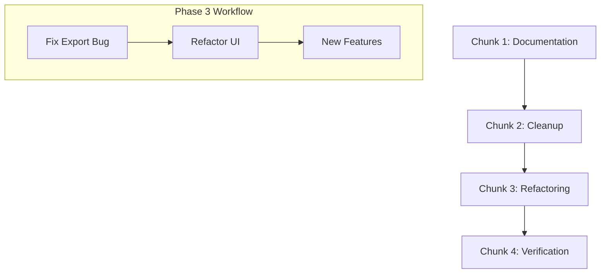

# Master Blueprint: Project Consolidation & Evolution

## Overview
This blueprint outlines the strategic reorganization of the WowFactor project, focusing on documentation consolidation, directory cleanup, code refactoring, and rigorous verification. The goal is to transition from a "development/reconnaissance" state to a "stable/production-ready" state.

---

## Chunk 1: Documentation Consolidation (The Living History)
**Objective:** Merge scattered documentation into a single, cohesive hierarchy that preserves historical context while providing clear current guidance.

### Strategy
1.  **Create `docs/archive/`**: Move all legacy `.txt`, old `.md` files, and phase-specific plans here to preserve history without cluttering the main view.
2.  **Establish Core Docs Hierarchy**:
    *   `README.md`: High-level overview, installation, and quick start (Current state is good).
    *   `docs/ARCHITECTURE.md`: Technical deep dive into threading models, screen architecture, and data flow.
    *   `docs/CHANGELOG.md`: Chronological record of versions and major changes (Consolidate `IMPLEMENTATION_SUMMARY.md` here).
    *   `docs/DEVELOPMENT.md`: Guidelines for contributors, coding standards, and testing protocols.
    *   `TESTS_README.md`: Maintain as the primary source for test suite documentation.
3.  **Merge Process**:
    *   Extract "Known Issues" from `DOCUMENTATION.md` into a dedicated `docs/ISSUES.md` or keep in `CHANGELOG.md`.
    *   Move implementation summaries into the `CHANGELOG.md` under appropriate version headers.

---

## Chunk 2: Project Cleanup & Reorganization (The Hygiene Phase)
**Objective:** Remove redundant artifacts and organize files into logical, purpose-driven directories.

### Strategy
1.  **Data Management**:
    *   Create `data/scores/`: Move all `.csv` score files here.
    *   Create `data/exports/`: A temporary landing zone for user exports (if applicable).
2.  **Artifact Purge**:
    *   Identify and delete redundant test outputs: `pytest_output.txt`, `pytest_after_fix*.txt`, `test_run_output*.txt`, etc.
    *   Delete legacy/unused files identified during reconnaissance (e.g., `wow_core.py` if fully migrated to `core/`).
3.  **Directory Restructuring**:
    *   Ensure all core logic resides in `core/`.
    *   Ensure all UI components reside in `ui/`.
    *   Standardize the root directory to contain only entry points, config, and top-level docs.

---

## Chunk 3: Code Evolution & Refactoring (The Quality Phase)
**Objective:** Address technical debt and implement identified feature opportunities.

### Strategy
1.  **Immediate Fixes (High Priority)**:
    *   Implement `export_to_csv()` in `ViewAllScoresScreen` to resolve the current test failure.
2.  **Refactoring Roadmap**:
    *   **Componentization**: Extract repetitive UI patterns from `ui/screens/*.py` into reusable widgets in `ui/components.py`.
    *   **Logic Decoupling**: Ensure `core/` functions are pure and independent of the TUI where possible to facilitate easier unit testing.
    *   **Error Handling Standardization**: Implement a unified error reporting mechanism across `core/` and `ui/`.
3.  **Feature Implementation (Phased)**:
    *   **Phase 3A (Data Visualization)**: Implement JSON export and basic chart rendering in the Analytics screen.
    *   **Phase 3B (UX Enhancements)**: Add keyboard shortcuts and advanced filtering/search capabilities.

---

## Chunk 4: Verification & Hygiene Protocols (The Stability Phase)
**Objective:** Ensure every change is validated and that the project remains in a "green" state.

### Strategy
1.  **Automated Validation**:
    *   Mandatory `pytest` execution after every code modification.
    *   Integration of a "Pre-Commit" style check (manual or scripted) to ensure no redundant `.txt` files are left in the root.
2.  **Documentation Sync**:
    *   Every feature implementation must include an update to `docs/CHANGELOG.md`.
    *   Every new test file must be documented in `TESTS_README.md`.
3.  **Final Verification Protocol**:
    *   Run the full suite: `.venv/bin/python3 -m pytest tests/ -v`.
    *   Verify all "Known Issues" in `TESTS_README.md` are marked as resolved.

---

## Execution Dependency Graph

