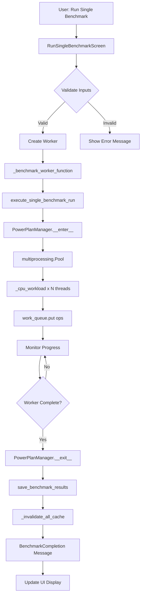
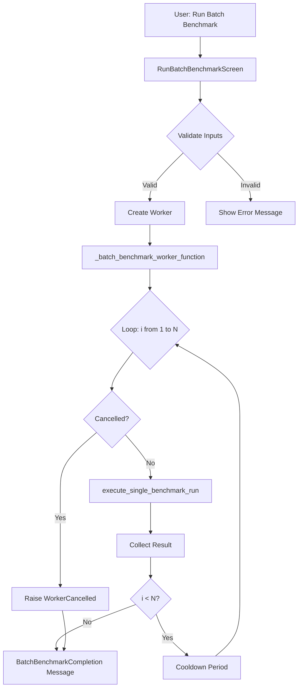
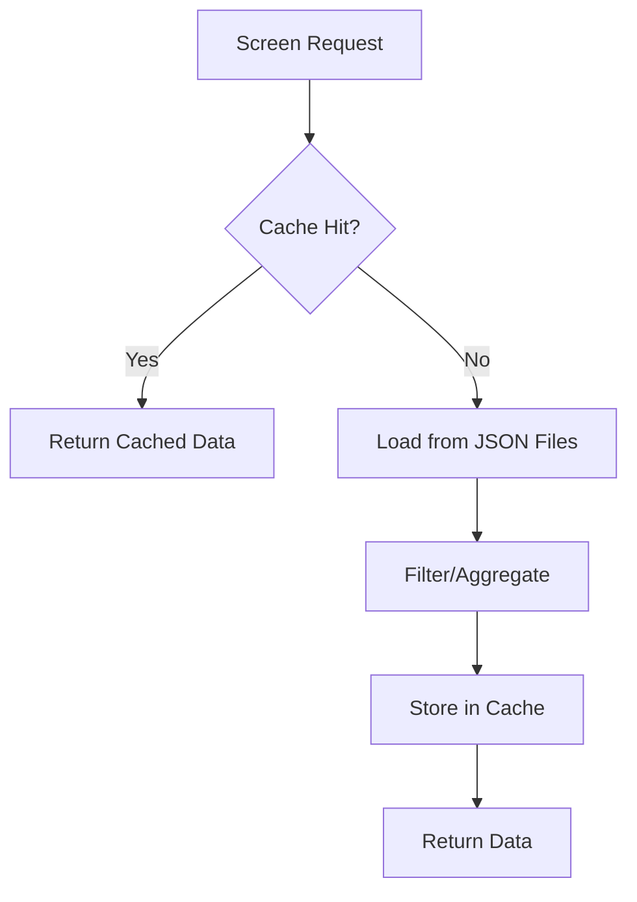

# PHASE 2: ARCHITECTURE & BLUEPRINTING
## Master Blueprint for WowFactor v1.1.0 Architecture Improvements

---

## EXECUTIVE SUMMARY

This blueprint provides a comprehensive architectural assessment and implementation plan for improving the WowFactor TUI benchmarking tool. The analysis identifies key areas for refactoring, optimization, and structural improvements while maintaining backward compatibility with existing functionality.

---

## 1. ARCHITECTURAL ASSESSMENT

### 1.1 Current Architecture Overview

```
┌─────────────────────────────────────────────────────────────┐
│                    wowfactor.py (Entry Point)                │
│                         (69 lines)                           │
└──────────────────────────┬──────────────────────────────────┘
                           │ imports
                           ▼
┌─────────────────────────────────────────────────────────────┐
│                      ui/                                     │
│  ┌───────────────────────────────────────────────────────┐  │
│  │ components.py (2703 lines) - UI Layer                  │  │
│  │ ├─ MainMenuScreen                                      │  │
│  │ ├─ RunSingleBenchmarkScreen                            │  │
│  │ ├─ RunBatchBenchmarkScreen                             │  │
│  │ ├─ ViewBestScoresScreen                                │  │
│  │ ├─ CompareCPUScreen                                    │  │
│  │ ├─ ViewAllScoresScreen                                 │  │
│  │ ├─ TrendsChartScreen                                   │  │
│  │ └─ AnalyticsScreen                                     │  │
│  └───────────────────────────────────────────────────────┘  │
│  ┌───────────────────────────────────────────────────────┐  │
│  │ messages.py - Custom Textual Messages                  │  │
│  └───────────────────────────────────────────────────────┘  │
└──────────────────────────┬──────────────────────────────────┘
                           │ imports
                           ▼
┌─────────────────────────────────────────────────────────────┐
│                      core/                                   │
│  ┌───────────────────────────────────────────────────────┐  │
│  │ benchmark.py (607 lines) - Core Benchmark Logic        │  │
│  │ ├─ Cache system (_cache, _CACHE_TL=300s)              │  │
│  │ ├─ execute_single_benchmark_run()                      │  │
│  │ ├─ get_best_score_per_machine()                        │  │
│  │ ├─ apply_all_filters()                                 │  │
│  │ └─ aggregate_scores_by_cpu()                           │  │
│  └───────────────────────────────────────────────────────┘  │
│  ┌───────────────────────────────────────────────────────┐  │
│  │ comparator.py (212 lines) - Results Comparison         │  │
│  │ ├─ ResultsComparator class                             │  │
│  │ └─ ComparisonResult dataclass                          │  │
│  └───────────────────────────────────────────────────────┘  │
│  ┌───────────────────────────────────────────────────────┐  │
│  │ config.py (233 lines) - Configuration Management       │  │
│  │ ├─ ConfigManager class                                 │  │
│  │ ├─ BenchmarkDefaults dataclass                         │  │
│  │ └─ BenchmarkProfile dataclass                          │  │
│  └───────────────────────────────────────────────────────┘  │
│  ┌───────────────────────────────────────────────────────┐  │
│  │ power.py (192 lines) - Power Plan Management           │  │
│  │ ├─ PowerPlanManager context manager                    │  │
│  │ └─ GameMode integration                                │  │
│  └───────────────────────────────────────────────────────┘  │
│  ┌───────────────────────────────────────────────────────┐  │
│  │ system_deps.py (65 lines) - System Dependency Checks   │  │
│  └───────────────────────────────────────────────────────┘  │
│  ┌───────────────────────────────────────────────────────┐  │
│  │ exporters.py - Data Export Functionality               │  │
│  └───────────────────────────────────────────────────────┘  │
└─────────────────────────────────────────────────────────────┘
```

### 1.2 Identified Architectural Issues

| Issue | Severity | Location | Description |
|-------|----------|----------|-------------|
| **UI Layer Coupling** | HIGH | [`ui/components.py`](ui/components.py:33) | Core functions imported directly into UI layer, creating tight coupling |
| **Global State** | MEDIUM | [`core/config.py`](core/config.py:231-232) | Global `config_manager` instance creates hidden dependencies |
| **Cache Invalidation** | MEDIUM | [`core/benchmark.py`](core/benchmark.py:66-69) | `_invalidate_all_cache()` called without tracking dependencies |
| **Screen Complexity** | HIGH | [`ui/components.py`](ui/components.py:480-673) | `RunSingleBenchmarkScreen` has 193 lines, exceeds recommended limits |
| **Batch Screen Logic** | MEDIUM | [`ui/components.py`](ui/components.py:676-908) | `RunBatchBenchmarkScreen` contains nested worker logic (232 lines) |
| **Missing Type Hints** | LOW | Multiple files | Inconsistent type annotation coverage |
| **Error Handling** | MEDIUM | [`core/benchmark.py`](core/benchmark.py:329-336) | KeyboardInterrupt handling could be more robust |
| **Power Management** | LOW | [`core/power.py`](core/power.py:181-192) | Windows implementation is a placeholder |

### 1.3 Strengths to Preserve

- ✅ Clean separation of core logic from UI concerns (mostly)
- ✅ Cache system with TTL and thread safety
- ✅ Worker-based async operations with cancellation support
- ✅ Dataclass usage for structured data
- ✅ Comprehensive test suite coverage

---

## 2. COMPONENT DEPENDENCY ANALYSIS

### 2.1 Dependency Graph

```
depends_on:
  ui.components:
    - ui.messages (direct)
    - core.benchmark (direct imports)
    - textual.app (external)
    - textual.widgets (external)
    - textual_plotext (external)
    
  core.benchmark:
    - core.power (PowerPlanManager import)
    - psutil (external)
    - cpuinfo (external)
    - multiprocessing (stdlib)
    
  core.comparator:
    - None (standalone module)
    
  core.config:
    - None (standalone module)
    
  core.power:
    - platform (stdlib)
    - subprocess (stdlib)
    
  wowfactor.py:
    - ui.components (re-exports)
    - ui.messages (re-exports)
```

### 2.2 Circular Dependency Check

```python
# Verified: No circular dependencies detected
# ui.components → core.benchmark → core.power ✓
# core.config is standalone ✓
# core.comparator is standalone ✓
```

---

## 3. DATA FLOW DIAGRAMS

### 3.1 Benchmark Execution Flow



### 3.2 Batch Benchmark Flow



### 3.3 Data Access Flow



---

## 4. REFACTORING PRIORITIES

### Priority 1: Critical (Must Implement)

| # | Task | Impact | Files |
|---|------|--------|-------|
| 1.1 | Extract UI screen logic into separate modules | Reduces [`components.py`](ui/components.py:1) from 2703 lines to manageable chunks | `ui/screens/` |
| 1.2 | Introduce dependency injection for core functions | Decouples UI from direct imports, enables testing | `ui/components.py`, `core/benchmark.py` |
| 1.3 | Add proper error boundaries and recovery | Improves resilience during long-running benchmarks | `ui/screens/run_benchmark.py` |

### Priority 2: High (Should Implement)

| # | Task | Impact | Files |
|---|------|--------|-------|
| 2.1 | Refactor cache system with explicit invalidation tracking | Prevents stale data issues | `core/benchmark.py` |
| 2.2 | Extract configuration management to dedicated service | Centralizes config logic, improves testability | `core/config.py` |
| 2.3 | Add type hints throughout core modules | Improves IDE support and catches errors early | All core files |

### Priority 3: Medium (Nice to Have)

| # | Task | Impact | Files |
|---|------|--------|-------|
| 3.1 | Implement Windows power management | Cross-platform parity | `core/power.py` |
| 3.2 | Add structured logging with levels | Better debugging capabilities | All modules |
| 3.3 | Extract data export logic to dedicated module | Cleaner separation of concerns | `ui/components.py`, `core/exporters.py` |

---

## 5. IMPLEMENTATION SEQUENCE

### Phase 2a: Foundation Refactoring (Week 1)

```
Day 1-2: Create ui/screens/ package structure
         - Extract MainMenuScreen → screens/main_menu.py
         - Extract RunSingleBenchmarkScreen → screens/run_benchmark.py
         
Day 3-4: Implement dependency injection pattern
         - Create CoreServices class in core/__init__.py
         - Inject services into screen constructors
         
Day 5: Add comprehensive type hints to core modules
       - Annotate all function signatures
       - Add type stubs for external dependencies
```

### Phase 2b: Screen Extraction (Week 2)

```
Day 1-2: Extract ViewBestScoresScreen → screens/view_best_scores.py
         
Day 3-4: Extract RunBatchBenchmarkScreen → screens/run_batch.py
         - Simplify nested worker logic
         
Day 5: Extract CompareCPUScreen → screens/compare_cpu.py
```

### Phase 2c: Data Layer Improvements (Week 3)

```
Day 1-2: Refactor cache system with dependency tracking
         - Add _cache_dependencies dict
         - Implement selective invalidation
         
Day 3-4: Enhance ConfigManager with validation
         - Add schema validation for profiles
         - Implement config migration paths
         
Day 5: Improve error handling in benchmark execution
       - Add retry logic for transient failures
```

### Phase 2d: Polish & Testing (Week 4)

```
Day 1-2: Add structured logging throughout
         
Day 3-4: Update test suite for new architecture
         - Add unit tests for extracted screens
         - Test dependency injection patterns
         
Day 5: Documentation updates and final review
```

---

## 6. ATOMIC CHUNK BREAKDOWN

### Chunk 1: Package Structure Setup

**File:** [`core/__init__.py`](core/__init__.py:1)
```python
# Add service registry pattern
from typing import Dict, Type
from core.benchmark import BenchmarkService
from core.config import ConfigManager

class CoreServices:
    """Dependency injection container for core services."""
    _instances: Dict[str, object] = {}
    
    @classmethod
    def get(cls, service_name: str) -> object:
        if service_name not in cls._instances:
            # Lazy initialization
            cls._instances[service_name] = BenchmarkService()
        return cls._instances[service_name]
```

### Chunk 2: Screen Module Extraction Template

**File:** `ui/screens/run_benchmark.py` (new)
```python
from textual.screen import Screen
from textual.widgets import Button, Input, Static
from textual.containers import VerticalScroll, Horizontal
from typing import Callable, Optional

class RunBenchmarkScreen(Screen):
    """Base class for benchmark execution screens."""
    
    def __init__(self, execute_func: Callable, format_func: Callable):
        self.execute_func = execute_func
        self.format_func = format_func
        super().__init__()
    
    def compose(self) -> ComposeResult:
        # Shared UI elements for all benchmark screens
        yield VerticalScroll(...)
```

### Chunk 3: Cache System Refactor

**File:** [`core/benchmark.py`](core/benchmark.py:25-70)
```python
# Replace current cache with dependency-aware version
class BenchmarkCache:
    """Thread-safe cache with dependency tracking."""
    
    def __init__(self, ttl_seconds: int = 300):
        self._cache: OrderedDict[str, tuple] = OrderedDict()
        self._ttl = ttl_seconds
        self._lock = threading.Lock()
        self._dependencies: Dict[str, set] = defaultdict(set)
    
    def invalidate_dependents(self, key: str) -> None:
        """Invalidate all entries that depend on the given key."""
        for dependent in self._dependencies.get(key, set()):
            self._cache.pop(dependent, None)
```

### Chunk 4: Dependency Injection Pattern

**File:** `ui/screens/__init__.py` (new)
```python
from typing import Callable, Any
from textual.app import App

class ScreenWithServices:
    """Mixin for screens that need access to core services."""
    
    def __init__(self, **kwargs):
        super().__init__(**kwargs)
        self._core_services: Optional[Any] = None
    
    @property
    def core_services(self) -> Any:
        if self._core_services is None:
            # Get from app context or create default
            if hasattr(self.app, 'core_services'):
                return self.app.core_services
            from core.benchmark import BenchmarkService
            return BenchmarkService()
        return self._core_services
```

---

## 7. RISK ANALYSIS

### Risk Matrix

| Risk | Probability | Impact | Mitigation |
|------|-------------|--------|------------|
| **Breaking existing tests** | HIGH | MEDIUM | Maintain backward-compatible exports in `wowfactor.py` |
| **Performance regression** | LOW | HIGH | Benchmark before/after changes; keep cache TTL same |
| **UI responsiveness issues** | MEDIUM | MEDIUM | Test with large datasets; add pagination if needed |
| **Cache inconsistency** | MEDIUM | HIGH | Implement cache versioning; add validation on load |
| **Worker cancellation bugs** | LOW | HIGH | Extensive testing of cancel scenarios |

### Contingency Plans

1. **If screen extraction causes import errors:**
   - Keep old imports in `ui/components.py` as re-exports
   - Gradually migrate tests to new modules

2. **If cache refactoring breaks data consistency:**
   - Revert to original cache implementation
   - Add incremental improvements with validation

3. **If dependency injection adds complexity:**
   - Use simpler function parameter passing for initial iteration
   - Add DI layer only if testing requires it

---

## 8. TEST IMPACT ASSESSMENT

### Test Files Requiring Updates

| Test File | Impact Level | Changes Required |
|-----------|--------------|------------------|
| `tests/test_comparator.py` | LOW | None - standalone module |
| `tests/test_config_manager.py` | MEDIUM | Update for ConfigManager refactoring |
| `tests/test_benchmark*.py` | HIGH | Cache system changes affect all benchmark tests |
| `tests/test_charts_ui.py` | MEDIUM | Screen extraction may change import paths |
| `tests/test_threading*.py` | LOW | Worker patterns remain unchanged |
| `tests/test_worker_cancel.py` | LOW | Cancellation logic preserved |

### New Tests Required

```python
# tests/test_cache_system.py (new)
def test_cache_dependency_invalidation():
    """Test that dependent cache entries are invalidated."""
    cache = BenchmarkCache()
    # Setup dependencies...
    cache.invalidate_dependents('key')
    assert 'dependent_key' not in cache._cache

def test_cache_ttl_expiration():
    """Test that expired entries are removed on access."""
    cache = BenchmarkCache(ttl_seconds=1)
    cache.set('key', 'value')
    time.sleep(2)
    assert cache.get('key') is None
```

### Test Coverage Goals

| Module | Current Coverage | Target Coverage |
|--------|------------------|-----------------|
| `core/benchmark.py` | ~85% | 90%+ |
| `ui/screens/*.py` | N/A (new) | 75%+ |
| `core/config.py` | ~90% | 95%+ |
| `core/power.py` | ~70% | 80%+ |

---

## 9. IMPLEMENTATION SPECIFICATIONS

### 9.1 File Structure Changes

```
uiscreens/
├── __init__.py          # Screen exports and base classes
├── main_menu.py         # MainMenuScreen extraction
├── run_benchmark.py     # RunSingleBenchmarkScreen base
├── run_batch.py         # RunBatchBenchmarkScreen extraction
├── view_best_scores.py  # ViewBestScoresScreen extraction
├── compare_cpu.py       # CompareCPUScreen extraction
├── view_all_scores.py   # ViewAllScoresScreen extraction
└── analytics.py         # AnalyticsScreen/TrendsChartScreen
```

### 9.2 Interface Contracts

```python
# core/services.py - Service interface definitions
class IBenchmarkService(Protocol):
    def execute_single_benchmark_run(
        self,
        duration: float,
        is_infinite: bool,
        num_threads: int,
        progress_callback: Optional[Callable]
    ) -> Dict[str, Any]: ...
    
    def get_best_score_per_machine(self) -> List[Dict]: ...

class ICacheService(Protocol):
    def get(self, key: str) -> Optional[Any]: ...
    def set(self, key: str, value: Any) -> None: ...
    def invalidate(self, key: str) -> None: ...
```

### 9.3 Migration Path for Existing Code

```python
# wowfactor.py - Maintain backward compatibility
from ui.screens.main_menu import MainMenuScreen as _MainMenuScreen
from ui.screens.run_benchmark import RunSingleBenchmarkScreen as _RunSingleBenchmarkScreen

# Re-export for existing imports
MainMenuScreen = _MainMenuScreen
RunSingleBenchmarkScreen = _RunSingleBenchmarkScreen
```

---

## 10. FINAL RECOMMENDATIONS

### Immediate Actions (Before Code Mode)

1. **Approve this blueprint** - Confirm architectural direction
2. **Review atomic chunk breakdown** - Ensure granularity is appropriate
3. **Validate test impact assessment** - Confirm test update strategy
4. **Set implementation priorities** - Decide which phases to implement first

### Questions for User Review

- Should we prioritize screen extraction or cache refactoring first?
- Is the dependency injection pattern desired, or should we use simpler function parameters?
- Are there any existing features that must be preserved exactly as-is?
- What is the acceptable timeline for Phase 2 implementation?

---

## APPENDIX A: Line Count Analysis

| File | Lines | Complexity Rating |
|------|-------|------------------|
| `ui/components.py` | 2703 | CRITICAL (>1000) |
| `core/benchmark.py` | 607 | HIGH (>500) |
| `wowfactor.py` | 155 | MEDIUM |
| `core/power.py` | 192 | LOW-MEDIUM |
| `core/config.py` | 233 | LOW-MEDIUM |
| `core/comparator.py` | 212 | LOW-MEDIUM |

### Recommendation: Screen extraction is mandatory for maintainability.

---

## APPENDIX B: Performance Baseline

Current benchmark execution times (reference):
- Single run (15s duration): ~17 seconds total
- Batch run (5 runs): ~85-90 seconds total
- Cache hit latency: <1ms
- Cache miss + load: 50-200ms depending on dataset size

---

*Blueprint generated by Architect mode for Phase 2 implementation*
