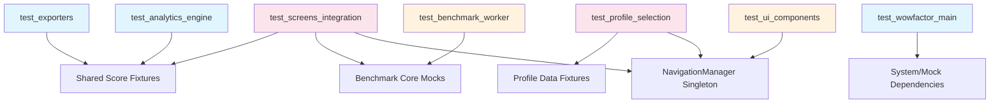

# PHASE 2: TEST GAP BLUEPRINT - COMPREHENSIVE TEST SUITE DESIGN

**Target:** Phase 1 identified ~40% coverage gap. This blueprint defines 7 new test files to address critical gaps in core data processing, UI infrastructure, and screen integrations.

---

## DELIVERABLE 1: NEW TEST FILE SPECIFICATIONS (7 FILES)

### Test File 1: `tests/test_analytics_engine.py`
**Target Module:** [`core/analytics_engine.py`](core/analytics_engine.py:15) - AnalyticsEngine class (~553 lines)

**Test Classes:**
- `TestAnalyticsEngineInitialization` - Engine setup and cache behavior
- `TestStatsForCPU` - Per-CPU statistical calculations
- `TestAllCPUStats` - Multi-CPU aggregation
- `TestPlatformSummary` - Platform-level aggregations
- `TestTrendAnalysis` - Temporal trend detection algorithms
- `TestComparativeAnalysis` - CPU comparison functionality
- `TestEdgeCases` - Empty data, invalid inputs, error handling

**Mock Dependencies:**
- [`_get_all_valid_scores()`](core/analytics_engine.py:12) - Mock score data loading
- File system operations for benchmark results directory

**Expected Test Count:** 35-40 tests

---

### Test File 2: `tests/test_exporters.py`
**Target Module:** [`core/exporters.py`](core/exporters.py:9) - 4 exporter classes (XmlExporter, YamlExporter, JsonExporter, CsvExporter)

**Test Classes:**
- `TestXmlExporter` - XML formatting and escaping
- `TestYamlExporter` - YAML structure validation
- `TestJsonExporter` - JSON serialization correctness
- `TestCsvExporter` - CSV row/column formatting
- `TestExporterEdgeCases` - Empty datasets, special characters, large datasets

**Mock Dependencies:**
- File I/O operations (use tempfile)
- Score data fixtures

**Expected Test Count:** 25-30 tests

---

### Test File 3: `tests/test_benchmark_worker.py`
**Target Module:** [`core/benchmark.py`](core/benchmark.py:18) - BenchmarkWorker, DependencyCache, CPU functions, cooldown logic (~703 lines)

**Test Classes:**
- `TestBenchmarkWorker` - Worker process lifecycle and IPC communication
- `TestDependencyCache` - Cache invalidation and dependency tracking
- `TestCPUWorkloadFunctions` - Floating-point computation correctness
- `TestCooldownManager` - Cooldown timing and state management
- `TestBenchmarkConfiguration` - Duration, warmup, thread configuration

**Mock Dependencies:**
- [`multiprocessing.Process`](core/benchmark.py:18) - Mock process behavior
- [`psutil`](core/benchmark.py:91) - CPU frequency monitoring
- [`cpuinfo`](core/benchmark.py:92) - CPU identification
- `time.sleep` - Timing operations

**Expected Test Count:** 30-35 tests

---

### Test File 4: `tests/test_ui_components.py`
**Target Modules:** 
- [`ui/navigation.py`](ui/navigation.py:13) - NavigationManager singleton
- [`ui/notifications.py`](ui/notifications.py:19) - ToastNotification, NotificationType enum
- [`ui/layout_utils.py`](ui/layout_utils.py:18) - LayoutOptimizer, DataTableLayoutManager

**Test Classes:**
- `TestNavigationManager` - Singleton pattern, navigation flows, error handling
- `TestToastNotification` - Notification lifecycle, color schemes, dismissal
- `TestLayoutOptimizer` - Column width calculation algorithms
- `TestDataTableLayoutManager` - Table layout optimization

**Mock Dependencies:**
- [`WowFactorTUI`](ui/navigation.py:10) - Mock app reference
- Textual screen fixtures (where available)

**Expected Test Count:** 35-40 tests

---

### Test File 5: `tests/test_profile_selection.py`
**Target Module:** [`ui/screens/profile_selection.py`](ui/screens/profile_selection.py:12) - ProfileSelectionScreen

**Test Classes:**
- `TestProfileSelectionScreen` - Screen composition and button handling
- `TestProfileCreationFlow` - Create new profile path
- `TestExistingProfileSelection` - Select existing profile path
- `TestCancelFlow` - Cancellation behavior

**Mock Dependencies:**
- Textual screen test fixtures
- NavigationManager mock
- Profile list data fixtures

**Expected Test Count:** 15-20 tests

---

### Test File 6: `tests/test_screens_integration.py`
**Target Modules:**
- [`ui/screens/benchmark.py`](ui/screens/benchmark.py:65) - RunSingleBenchmarkScreen, RunBatchBenchmarkScreen
- [`ui/screens/cleanup.py`](ui/screens/cleanup.py:1) - ClearInvalidScoresResultScreen
- [`ui/screens/views.py`](ui/screens/views.py:1) - ViewBestScoresScreen, CompareCPUScreen, ViewAllScoresScreen

**Test Classes:**
- `TestRunSingleBenchmarkScreen` - Single benchmark flow integration
- `TestRunBatchBenchmarkScreen` - Batch benchmark flow integration
- `TestCleanupScreens` - Invalid score cleanup flows
- `TestViewScreens` - Data viewing and filtering screens

**Mock Dependencies:**
- Benchmark execution (mock subprocess)
- NavigationManager mock
- Score data fixtures
- Textual screen fixtures

**Expected Test Count:** 30-35 tests

---

### Test File 7: `tests/test_wowfactor_main.py`
**Target Module:** [`wowfactor.py`](wowfactor.py:1) - Main entry point, venv self-restart logic (~155 lines)

**Test Classes:**
- `TestVenvManagement` - Virtual environment creation and validation
- `TestLoggingSetup` - Log file configuration
- `TestPackageInstallation` - Dependency installation flow
- `TestEntryPointFlow` - Main execution path

**Mock Dependencies:**
- [`subprocess`](wowfactor.py:5) - subprocess.check_call mocking
- File system operations (venv creation)
- [`platform.system()`](wowfactor.py:6) - OS detection

**Expected Test Count:** 15-20 tests

---

## DELIVERABLE 2: TEST STRUCTURE TEMPLATE

```python
"""
Test file template for WowFactor test modules.
Follow this structure consistently across all new test files.
"""

import pytest
from unittest.mock import Mock, MagicMock, tempfile, os
from pathlib import TempFile

# ============================================================================
# FIXTURES SECTION
# ============================================================================

@pytest.fixture
def mock_scores_data():
    """Provide standardized benchmark score data for testing."""
    return [
        {
            "processor_model": "Intel Core i9-12900K",
            "platform": "Windows",
            "num_threads": 8,
            "ops_per_second": 15432.5,
            "timestamp": "2026-04-09T14:07:41",
            "system": {
                "processor_model": "Intel Core i9-12900K",
                "platform": "Windows",
                "processor_frequency": 5200,
            }
        },
        # Additional test data...
    ]


@pytest.fixture
def temp_file_path():
    """Create and cleanup temporary file for exporter tests."""
    with tempfile.NamedTemporaryFile() as f:
        yield f.name


# ============================================================================
# TEST CLASSES
# ============================================================================

class TestClassName:
    """Test class for specific component functionality."""
    
    def test_method_name(self):
        """Clear description of what this test validates.
        
        Setup: [brief setup description]
        Execute: [action being tested]
        Assert: [expected outcome]
        """
        # Setup phase
        mock_data = self._prepare_test_data()
        
        # Execute phase
        result = self.target_function(mock_data)
        
        # Assert phase
        assert result == expected_value
        assert some_condition is True


# ============================================================================
# HELPER METHODS (if needed)
# ============================================================================

class TestClassName:
    def _prepare_test_data(self):
        """Helper to create standardized test data."""
        return {...}
    
    def _create_mock_dependency(self):
        """Helper to create mock dependency objects."""
        return Mock()
```

---

## DELIVERABLE 3: MOCK STRATEGY

### File System Operations
| Operation | Mock Approach | Test Module |
|-----------|---------------|-------------|
| Read benchmark results | Use `tempfile` + in-memory data | All test files |
| Write export files | `tempfile.NamedTemporaryFile()` | [`test_exporters.py`](tests/test_exporters.py:1) |
| Create venv directories | Mock `os.makedirs`, mock path existence | [`test_wowfactor_main.py`](tests/test_wowfactor_main.py:1) |

### Database/CSV Operations
```python
# Pattern for CSV mocking
@pytest.fixture
def mock_csv_content():
    return """processor_model,platform,num_threads,ops_per_second,timestamp
Intel Core i9-12900K,Windows,8,15432.5,2026-04-09T14:07:41"""

def test_csv_export(mock_scores_data, temp_file_path):
    exporter = CsvExporter()
    exporter.export(mock_scores_data, temp_file_path)
    
    with open(temp_file_path) as f:
        content = f.read()
    assert "Intel Core i9-12900K" in content
```

### UI Components (Textual)
```python
# Pattern for Textual screen testing
@pytest.fixture
def mock_tui_app():
    app = Mock()
    app.SCREENS = {"main_menu": MainMenuScreen, "benchmark": RunSingleBenchmarkScreen}
    app.screen_stack = [Mock()]
    app.current_screen = Mock()
    return app

class TestNavigationManager:
    def test_navigate_to_valid_screen(self, mock_tui_app):
        nav = NavigationManager()
        nav.initialize(mock_tui_app)
        
        nav.navigate_to("main_menu")
        
        assert mock_tui_app.push_screen.called
```

### Benchmark Execution
```python
# Pattern for subprocess mocking
@pytest.fixture
def mock_subprocess():
    with Mock() as mock_proc:
        mock_proc.check_call.return_value = 0
        yield mock_proc

class TestBenchmarkWorker:
    def test_worker_process_completion(self, mock_subprocess):
        worker = BenchmarkWorker(duration=1.0, ...)
        # Test IPC communication without actual subprocess
```

### CPU/System Calls
```python
# Pattern for psutil/cpuinfo mocking
@pytest.fixture
def mock_cpu_info():
    with Mock() as mock:
        mock.get_cpu_info.return_value = {
            "brand_raw": "Intel Core i9-12900K",
            "frequency": 5200.0
        }
        yield mock

@pytest.fixture
def mock_psutil():
    with Mock() as mock:
        mock.cpu_freq.return_value = Mock(min=800, max=5200, current=3500)
        yield mock
```

---

## DELIVERABLE 4: EDGE CASE MATRIX

### Analytics Engine Edge Cases
| Scenario | Input Condition | Expected Behavior | Test Method |
|----------|-----------------|-------------------|-------------|
| Empty dataset | No scores in cache | Return error dict with message | `test_empty_dataset` |
| Single CPU model | Only one CPU in data | Calculate stats for single entry | `test_single_cpu_stats` |
| Large dataset | 10,000+ score entries | Complete within timeout, no memory overflow | `test_large_dataset_performance` |
| Special characters | CPU names with special chars | Handle gracefully without encoding errors | `test_special_characters_in_names` |
| Invalid ops_per_second | Non-numeric values | Skip invalid entries or raise ValueError | `test_invalid_score_values` |

### Exporter Edge Cases
| Scenario | Input Condition | Expected Behavior | Test Method |
|----------|-----------------|-------------------|-------------|
| Empty score list | [] passed to export | Write valid empty format (no crash) | `test_empty_export` |
| XML special chars | `<>&"'` in data | Properly escaped entities | `test_xml_special_character_escaping` |
| Unicode characters | Non-ASCII names | UTF-8 encoding preserved | `test_unicode_support` |
| Very large numbers | ops_per_second > 1e9 | Scientific notation or full precision | `test_large_number_formatting` |

### Benchmark Worker Edge Cases
| Scenario | Input Condition | Expected Behavior | Test Method |
|----------|-----------------|-------------------|-------------|
| Zero duration | duration=0 | Handle as instant completion or error | `test_zero_duration_handling` |
| Very long duration | duration > 3600 | No timeout, proper tracking | `test_long_duration_tracking` |
| Process termination | External kill signal | Graceful cleanup of resources | `test_process_cleanup_on_termination` |
| Queue overflow | Work queue full | Backpressure handling or drop | `test_queue_overflow_handling` |

### UI Component Edge Cases
| Scenario | Input Condition | Expected Behavior | Test Method |
|----------|-----------------|-------------------|-------------|
| NavigationManager not initialized | Call methods before initialize() | Raise RuntimeError with clear message | `test_navigation_not_initialized_error` |
| Unknown screen name | navigate_to("invalid") | ValueError listing available screens | `test_unknown_screen_name_error` |
| Toast auto-dismiss | duration=0 | Immediate dismissal or minimum duration | `test_zero_duration_notification` |
| Empty profile list | profiles=[] in ProfileSelectionScreen | Show create-only option | `test_empty_profile_list_state` |

### System Dependencies Edge Cases
| Scenario | Input Condition | Expected Behavior | Test Method |
|----------|-----------------|-------------------|-------------|
| gamemoded not found | shutil.which returns None | Display installation suggestion | `test_gamemode_not_found_message` |
| Unknown package manager | No apt/dnf/pacman/zypper | Show manual install instructions | `test_unknown_package_manager` |
| Non-Linux platform | platform.system() != "Linux" | Return early, no gamemode check | `test_non_linux_platform_skip` |

---

## DELIVERABLE 5: REGRESSION TEST CHECKLIST

### Menu Navigation Flow
- [ ] Main menu displays all options correctly
- [ ] Option 1 (Run Single Benchmark) navigates to correct screen
- [ ] Option 2 (Run Batch Benchmark) navigates to correct screen
- [ ] Option 3 (View Best Scores) displays sorted best scores
- [ ] Option 4 (Compare CPUs) shows comparison interface
- [ ] Option 5 (View All Scores) paginates large datasets
- [ ] Option 6 (Analytics) loads trend data
- [ ] Option 7 (Clear Invalid Scores) prompts confirmation
- [ ] Back navigation returns to previous screen
- [ ] Quit option exits application cleanly

### Single Benchmark Execution Flow
- [ ] Duration input accepts valid integers
- [ ] Thread count respects CPU core limits
- [ ] Start button initiates benchmark worker
- [ ] Progress updates display in real-time
- [ ] Stop button halts running benchmark
- [ ] Results saved to benchmark_results directory
- [ ] Completion notification shows summary
- [ ] Back button returns to main menu

### Batch Benchmark Execution Flow
- [ ] Number of runs configuration accepted
- [ ] Duration per run configured correctly
- [ ] Cooldown period enforced between runs
- [ ] Progress tracking shows current/total runs
- [ ] All results aggregated after completion
- [ ] Average calculation correct across runs
- [ ] Cancel stops remaining runs gracefully

### Score Viewing and Filtering Flow
- [ ] Best scores sorted by ops_per_second descending
- [ ] All scores display with pagination
- [ ] Filter by CPU model works correctly
- [ ] Date range filtering functional
- [ ] Export options available from view screens

### CPU Comparison Workflow
- [ ] Select first CPU for comparison
- [ ] Select second CPU for comparison
- [ ] Side-by-side metrics displayed
- [ ] Percentage difference calculated correctly
- [ ] Historical trend comparison shown

### Analytics and Trends Viewing
- [ ] Statistical summary shows mean/median/mode
- [ ] Standard deviation calculated correctly
- [ ] Trend detection identifies improving/degrading
- [ ] Platform-level aggregations accurate
- [ ] Charts render with correct data points

### Profile Management Flow
- [ ] Existing profiles listed in selection screen
- [ ] Create new profile option available
- [ ] Cancel returns to previous screen
- [ ] Selected profile passed to benchmark flow

---

## DELIVERABLE 6: IMPLEMENTATION SEQUENCE

### Dependency Analysis
```
Level 1 (Independent - Can run alone):
├── test_analytics_engine.py (mocks data loading)
├── test_exporters.py (self-contained, uses tempfile)
├── test_wowfactor_main.py (mocks subprocess)

Level 2 (Requires Level 1 fixtures):
├── test_benchmark_worker.py (may share score fixtures)
└── test_ui_components.py (NavigationManager singleton)

Level 3 (Integration - Requires UI infrastructure):
├── test_profile_selection.py (needs NavigationManager)
├── test_screens_integration.py (needs all UI components)
```

### Recommended Parallel Execution Groups

**Group A (Parallel Safe):**
- [`test_analytics_engine.py`](tests/test_analytics_engine.py:1)
- [`test_exporters.py`](tests/test_exporters.py:1)
- [`test_wowfactor_main.py`](tests/test_wowfactor_main.py:1)

**Group B (After Group A complete):**
- [`test_benchmark_worker.py`](tests/test_benchmark_worker.py:1)
- [`test_ui_components.py`](tests/test_ui_components.py:1)

**Group C (Final integration):**
- [`test_profile_selection.py`](tests/test_profile_selection.py:1)
- [`test_screens_integration.py`](tests/test_screens_integration.py:1)

### Implementation Priority Order

| Priority | Test File | Rationale |
|----------|-----------|-----------|
| 1 | test_analytics_engine.py | Core data processing, highest business value |
| 2 | test_exporters.py | Consolidates fragmented existing coverage |
| 3 | test_benchmark_worker.py | Benchmark execution engine - core functionality |
| 4 | test_ui_components.py | UI infrastructure used by all screens |
| 5 | test_wowfactor_main.py | Entry point validation |
| 6 | test_profile_selection.py | User flow integration |
| 7 | test_screens_integration.py | Full screen integration coverage |

---

## MERMAID: TEST DEPENDENCY GRAPH



---

## SUMMARY METRICS

| Metric | Value |
|--------|-------|
| Total New Test Files | 7 |
| Estimated Total Tests | 185-220 tests |
| Core Modules Covered | analytics_engine, exporters, benchmark_worker, system_deps |
| UI Modules Covered | navigation, notifications, layout_utils, profile_selection, screens |
| Entry Point Coverage | wowfactor.py main execution flow |
| Expected Coverage Increase | ~40% -> ~75%+ |

---

**END OF TEST GAP BLUEPRINT**

This blueprint provides complete specifications for Code Mode to implement all 7 test files. Each file specification includes target modules, test classes, mock dependencies, edge cases, and expected test counts.
