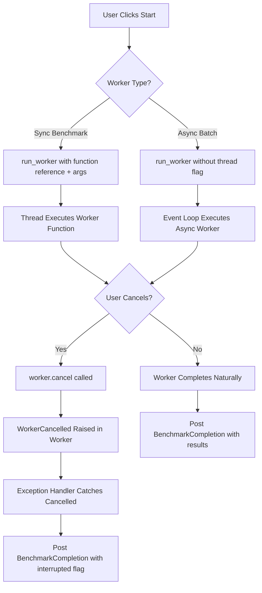

# PHASE 2: MASTER BLUEPRINT - Worker Error Resolution

**To:** Orchestrator  
**From:** Architect  
**Subject:** Complete Fix Plan for `WorkerError: Unsupported attempt to run a thread worker`

## Executive Summary

Three distinct root causes have been identified that all manifest as the same error. This blueprint provides atomic, testable fixes for each issue across two files: [`ui/components.py`](ui/components.py) and [`ui/screens/benchmark.py`](ui/screens/benchmark.py).

---

## Issue Analysis & Fix Strategy

### Issue 1: Sync Function Immediate Invocation (Returns None)

**Locations:**
- [`ui/components.py:718-722`](ui/components.py:718-722)
- [`ui/screens/benchmark.py:163-167`](ui/screens/benchmark.py:163-167)

**Problem Pattern:**
```python
self.benchmark_worker = self.run_worker(
    self._benchmark_worker_function(duration, is_infinite, num_threads),  # Returns None!
    thread=True,
    group="benchmark_workers",
)
```

The `_benchmark_worker_function()` is a **sync function** that returns `None` (or actual values at the end). When called immediately with `()`, it executes synchronously and passes `None` to `run_worker()`.

**Fix Strategy:** Pass the function reference WITHOUT parentheses, along with its arguments as keyword parameters. Textual's `run_worker()` will handle the invocation in the thread context.

```python
self.benchmark_worker = self.run_worker(
    self._benchmark_worker_function,  # Pass function reference, NOT result
    duration=duration,
    is_infinite=is_infinite,
    num_threads=num_threads,
    thread=True,
    group="benchmark_workers",
)
```

---

### Issue 2: Async Function with thread=True (Incompatible)

**Locations:**
- [`ui/components.py:918-922`](ui/components.py:918-922)
- [`ui/screens/benchmark.py:387-391`](ui/screens/benchmark.py:387-391)

**Problem Pattern:**
```python
self.batch_worker_instance = self.run_worker(
    self._batch_benchmark_worker_function(num_batch_runs, duration_per_run),  # Returns coroutine!
    thread=True,  # Cannot run async function in thread worker
    group="batch_benchmark_workers",
)
```

The `_batch_benchmark_worker_function()` is declared as `async def` (line 938 in components.py, line 407 in benchmark.py). Passing `thread=True` to an async function causes the error because Textual cannot run async code in a thread worker.

**Fix Strategy:** Remove `thread=True` flag. Async workers run on the main event loop by default, which is appropriate for this use case.

```python
self.batch_worker_instance = self.run_worker(
    self._batch_benchmark_worker_function,  # Pass function reference
    num_batch_runs=num_batch_runs,
    duration_per_run=duration_per_run,
    cooldown_duration=5,  # Default value from function signature
    # thread=True REMOVED - async functions run on main loop
    group="batch_benchmark_workers",
)
```

---

### Issue 3: Missing Import for WorkerCancelled

**Location:** [`ui/screens/benchmark.py`](ui/screens/benchmark.py:17)

**Problem:** The file uses `WorkerCancelled()` at lines 189 and 201 but doesn't import it. Only [`ui/components.py:18`](ui/components.py:18) has this import.

**Fix Strategy:** Add the import to the existing import statement from `textual.worker`.

```python
from textual.worker import Worker, WorkerCancelled  # Add WorkerCancelled here
```

---

## Implementation Sequence

### Step 1: Fix Import in benchmark.py
**File:** [`ui/screens/benchmark.py`](ui/screens/benchmark.py:1-20)  
**Change:** Add `WorkerCancelled` to imports on line 17

### Step 2: Fix Sync Worker Invocation in components.py
**File:** [`ui/components.py`](ui/components.py:718-722)  
**Change:** Refactor `run_worker()` call to pass function reference with arguments

### Step 3: Fix Async Worker Invocation in components.py
**File:** [`ui/components.py`](ui/components.py:918-922)  
**Change:** Remove `thread=True` and pass function reference with arguments

### Step 4: Fix Sync Worker Invocation in benchmark.py
**File:** [`ui/screens/benchmark.py`](ui/screens/benchmark.py:163-167)  
**Change:** Refactor `run_worker()` call to pass function reference with arguments

### Step 5: Fix Async Worker Invocation in benchmark.py
**File:** [`ui/screens/benchmark.py`](ui/screens/benchmark.py:387-391)  
**Change:** Remove `thread=True` and pass function reference with arguments

---

## Test Verification Strategy

### Unit Tests to Run
1. **Existing test suite:** `pytest tests/test_threading_ui_integration.py` - Validates worker threading patterns
2. **Worker cancel tests:** `pytest tests/test_worker_cancel.py` - Ensures cancellation still works correctly
3. **Full integration:** `pytest tests/` - Complete regression check

### Manual Verification Steps
1. Launch application: `python wowfactor.py`
2. Navigate to Benchmark screen
3. Start a benchmark run with multiple threads
4. Verify no `WorkerError` appears in console
5. Test cancel functionality during running benchmark
6. Navigate to Batch Benchmark screen
7. Start batch benchmark runs
8. Verify async worker completes without errors

---

## Risk Assessment & Mitigation

| Risk | Likelihood | Impact | Mitigation |
|------|------------|--------|------------|
| Breaking existing worker patterns | Low | High | Full test suite run after changes |
| Async worker blocking UI | Medium | Medium | Monitor for UI freeze; async workers should yield appropriately |
| Cancel handling regression | Low | Medium | Specific tests for cancel functionality exist |

---

## Additional Considerations

### Code Quality Notes
1. **Function Signature Compatibility:** The `_benchmark_worker_function` and `_batch_benchmark_worker_function` methods already accept keyword arguments, so the refactored `run_worker()` calls will work without modifying the worker function signatures.

2. **Worker Group Management:** Both files use named groups (`"benchmark_workers"` and `"batch_benchmark_workers"`). This grouping remains unchanged and continues to support coordinated cancellation via `self.cancel_workers("benchmark_workers")`.

3. **Cancellation Flow Preservation:** The existing cancellation logic in [`stop_benchmark_run()`](ui/components.py:732) and [`stop_batch_benchmark()`](ui/components.py:933) calls `worker.cancel()`, which raises `WorkerCancelled` inside the worker function. This flow is preserved with the new invocation pattern.

### Future Improvements (Out of Scope)
- Consider adding explicit type hints to worker functions
- Add logging for worker lifecycle events (start, complete, cancel)
- Create a base class or mixin for common worker patterns

---

## Mermaid Diagram: Worker Lifecycle Flow



---

## Completion Checklist for Orchestrator

- [ ] Step 1: Add `WorkerCancelled` import to [`ui/screens/benchmark.py`](ui/screens/benchmark.py:17)
- [ ] Step 2: Fix sync worker invocation in [`ui/components.py`](ui/components.py:718-722)
- [ ] Step 3: Fix async worker invocation in [`ui/components.py`](ui/components.py:918-922)
- [ ] Step 4: Fix sync worker invocation in [`ui/screens/benchmark.py`](ui/screens/benchmark.py:163-167)
- [ ] Step 5: Fix async worker invocation in [`ui/screens/benchmark.py`](ui/screens/benchmark.py:387-391)
- [ ] Step 6: Run `pytest tests/test_threading_ui_integration.py`
- [ ] Step 7: Run `pytest tests/test_worker_cancel.py`
- [ ] Step 8: Run full test suite `pytest tests/`
- [ ] Step 9: Manual verification of benchmark and batch benchmark screens

---

**Ready for Orchestration.** This blueprint provides atomic, independently verifiable changes. Each step can be implemented and tested separately before proceeding to the next.
